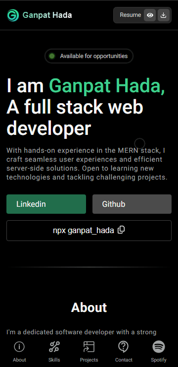

# Portfolio Website

Welcome 👋  
Here is my live portfolio:  
🔗 https://ganpathada22.netlify.app

---

## 🖥️ Portfolio Preview – Desktop / Laptop

  

---

## 📱 Portfolio Preview – Mobile

  

---

## 🚀 Features

- **Responsive Design** – Optimized for desktop, tablet, and mobile
- **Projects Showcase** – Live demos with descriptions
- **Skills Section** – Clear tech stack visibility
- **Contact Form** – Easy reach-out for recruiters
- **Smooth Animations** – Polished user experience
- **Spotify Route** – Displays real-time Spotify activity

---

## 🛠️ Built With

- **Frontend**: React.js  
- **Deployment**: Vercel  
- **Version Control**: Git & GitHub
